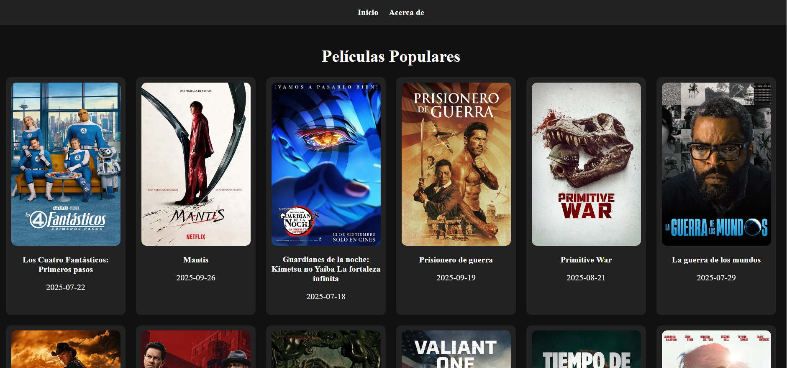

# 🎥 Aplicación de Películas - Jhones

Aplicación web sencilla desarrollada con **React.js + Vite** que muestra información de películas populares.  
La aplicación incluye navegación entre páginas, componentes reutilizables y diseño responsivo.  

---

## 🚀 Características
- ✅ Interfaz de usuario interactiva y responsiva.  
- ✅ Uso de componentes funcionales en **React**.  
- ✅ Estilos aplicados con **CSS**.  
- ✅ Código bien estructurado y organizado.  
- ✅ Navegación básica entre páginas.  

---

## 📂 Estructura del Proyecto

---

## 🛠️ Tecnologías usadas
- [React.js](https://react.dev/)  
- [Vite](https://vitejs.dev/)  
- [CSS3](https://developer.mozilla.org/es/docs/Web/CSS)  
- [JavaScript ES6+](https://developer.mozilla.org/es/docs/Web/JavaScript)

---

## 📸 Capturas de pantalla

### 🎬 Vista principal - Películas populares
## 📸 Captura de la aplicación




## ⚙️ Instalación y uso

1. Clonar el repositorio  
   ```bash
   git clone https://github.com/jhones1135/aplicacion-de-peliculas-jhones.git
